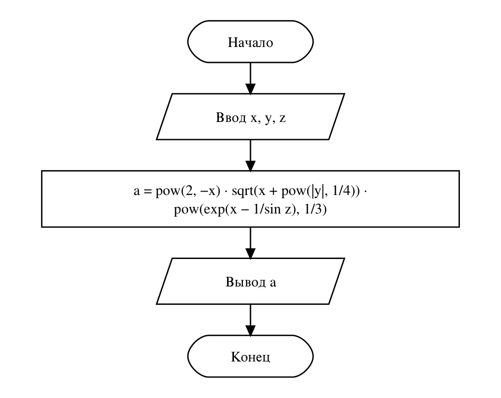

# Домашнее задание к работе №5
Вариант 10

## Условие задачи
Создать программу вычисления указанной величины. Результат проверить при заданных исходных значениях.

$$a = 2^{-x}\sqrt{x + \sqrt[4]{|y|}}\cdot\sqrt[3]{e^{x - 1/\sin z}}$$

Контрольный пример: при x = 3.981·10⁻², y = −1.625·10³, z = 0.512 результат **1.26185**.

## 1. Алгоритм и блок-схема
### Алгоритм:
1. Начало.
2. Объявить вещественные переменные **x, y, z** — исходные данные и **a** — результат.
3. Ввести x, y, z.
4. Вычислить **a** по формуле с помощью функций из math.h: **pow, sqrt, fabs, exp, sin**. Корень 4-й степени и кубический корень записываются как возведение в степень 1/4 и 1/3.
5. Вывести исходные данные и a с точностью 5 знаков после запятой.
6. Конец.

### Блок-схема:


## 2. Реализация программы
```c
#define _CRT_SECURE_NO_DEPRECATE
#define _USE_MATH_DEFINES
#include <stdio.h>
#include <locale.h>
#include <math.h>

// Вариант 10
// a = 2^(-x) * sqrt(x + |y|^(1/4)) * cbrt(e^(x - 1/sin(z)))
// Контрольный пример: x = 3.981e-2, y = -1.625e3, z = 0.512, a = 1.26185
int main() {
    setlocale(LC_CTYPE, "RUS");
    double x, y, z, a;
    puts("a = 2^(-x) * sqrt(x + |y|^(1/4)) * cbrt(e^(x - 1/sin(z)))");
    puts("Введите x, y, z");
    scanf("%lf %lf %lf", &x, &y, &z);
    a = pow(2.0, -x) * sqrt(x + pow(fabs(y), 1.0 / 4)) * pow(exp(x - 1 / sin(z)), 1.0 / 3);
    printf("При x = %g, y = %g, z = %g\na = %.5f\n", x, y, z, a);
    return 0;
}
```

## 3. Результаты работы программы
Случай 1:
```
a = 2^(-x) * sqrt(x + |y|^(1/4)) * cbrt(e^(x - 1/sin(z)))
Введите x, y, z
3.981e-2 -1.625e3 0.512
При x = 0.03981, y = -1625, z = 0.512
a = 1.26185
```
Случай 2:
```
a = 2^(-x) * sqrt(x + |y|^(1/4)) * cbrt(e^(x - 1/sin(z)))
Введите x, y, z
1 16 1.5
При x = 1, y = 16, z = 1.5
a = 0.86530
```

## 4. Информация о разработчике
Файко Андрей Юрьевич, бТИИ-262
